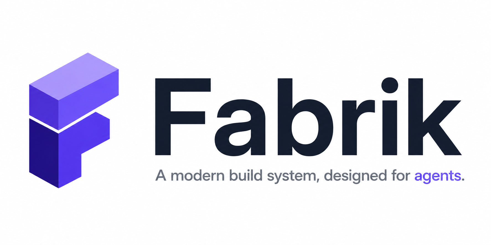

<p align="center">
  
</p>

<p align="center">
  <a href="https://github.com/tuist/fabrik/actions/workflows/fabrik.yml"></a>
  <a href="https://github.com/tuist/fabrik/releases/latest"></a>
  <a href="LICENSE"></a>
</p>

# Fabrik

Fabrik is a polyglot, agent-native build system. It uses content-addressed actions, structured declarations, and explicit runtime semantics so humans and coding agents can build, run, test, and debug the same graph.

## Quick Start

Install `fabrik`, then initialize a project:

```sh
fabrik --list
fabrik init
fabrik init --templates
fabrik init rust-app --path hello
```

Use the canonical template ids printed by `fabrik init --templates`, for example `rust-app`.

## Documentation

Read the documentation at [fabrik.run](https://fabrik.run).

## License

[MIT](LICENSE).
