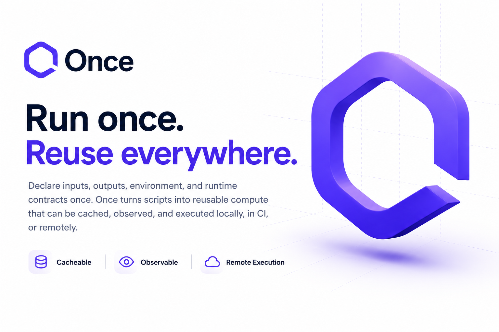

<p align="center">
  
</p>

<p align="center">
  <a href="https://github.com/tuist/once/actions/workflows/once.yml"></a>
  <a href="https://github.com/tuist/once/releases/latest"></a>
  <a href="LICENSE"></a>
</p>

# Once

Once makes project scripts cacheable, observable, and remotely executable. Declare the inputs, outputs, environment, and runtime contract once, then reuse the result locally, in CI, or on a compute provider.

## Quick Start

Describe a script with `# once` annotations:

```sh
#!/usr/bin/env bash
# once input "../assets/**/*"
# once output "../dist/"
# once cwd ".."

npm run build-assets
```

Run it through the cache:

```sh
once exec -- bash scripts/build-assets.sh
once exec --remote --compute microsandbox -- bash scripts/build-assets.sh
```

Scripts can also run directly with a Once shebang:

```sh
#!/usr/bin/env -S once exec -- bash
```

## Documentation

Read the documentation at [once.tuist.dev](https://once.tuist.dev).

## License

[MIT](LICENSE).
