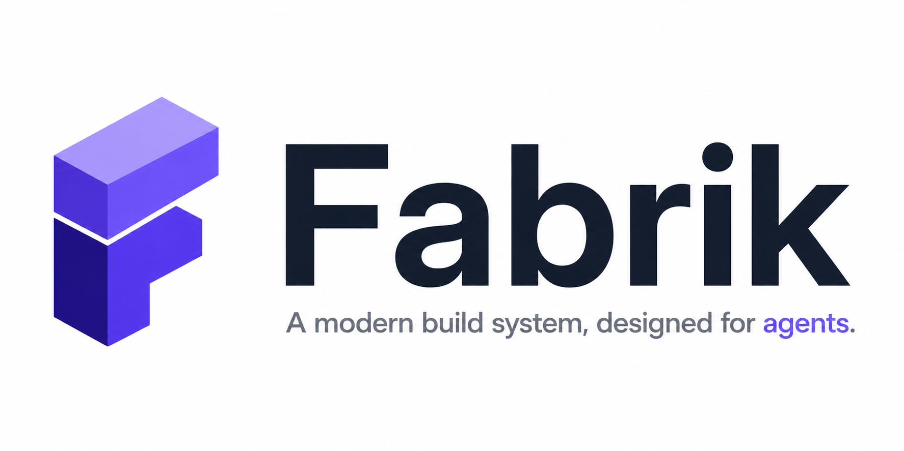

<p align="center">
  
</p>

<p align="center">
  <a href="https://github.com/tuist/once/actions/workflows/once.yml"></a>
  <a href="https://github.com/tuist/once/releases/latest"></a>
  <a href="LICENSE"></a>
  <a href="https://buildonce.dev/docs"></a>
</p>

<h1 align="center">Once</h1>

<p align="center">
  🧱 Build once. ♻️ Reuse everywhere.
</p>

Once turns repository automation into typed, cacheable actions that humans and
coding agents can discover, run, and reuse. Give every action explicit inputs,
outputs, and environment, and Once content-addresses the result so it only ever
runs when something actually changed, locally or on a shared cache, across
developers, coding agents, continuous integration, and machines.

## ✨ Why Once

- 🧱 **Build once**: declare inputs, outputs, and environment; results are content-addressed.
- ♻️ **Reuse everywhere**: restore outputs instantly from a local or shared cache.
- 🚀 **Run anywhere**: send only the declared inputs to a fresh local or hosted sandbox.
- 🤖 **Agent-native**: a built-in [Model Context Protocol](https://modelcontextprotocol.io/) server lets coding agents discover and run actions.
- 🌍 **Multi-ecosystem**: native support for Apple, Android, Kotlin, Rust, Go, C/C++, Elixir, Ruby, JavaScript, Zig, and more.

## 📦 Install

Install the current release with [mise](https://mise.jdx.dev/):

```sh
mise use -g "github:tuist/once@$(mise latest github:tuist/once)"
mise exec -- once --version
```

Use `mise use github:tuist/once@...` inside a repository when the project
should pin Once in its own `mise.toml`.

## 🤖 Connect a coding harness

Once includes a [Model Context Protocol](https://modelcontextprotocol.io/)
server. Add it to a coding harness that supports servers over standard input
and output, and start it through mise so global installs and project pins both
work:

```json
{
  "mcpServers": {
    "once": {
      "command": "mise",
      "args": [
        "-C",
        "/absolute/path/to/your/project",
        "exec",
        "--",
        "once",
        "mcp",
        "--workspace",
        "/absolute/path/to/your/project",
        "--allow-run"
      ]
    }
  }
}
```

Remove `--allow-run` if the harness should not edit manifests, build, test,
run, or start runtime sessions.

Then ask the harness something like:

```text
Use Once to initialize this directory as a Rust binary package. Discover the
available target kinds, fetch the Rust binary starter, create the files, and
build the target.
```

The harness discovers target kinds, fetches starter metadata, materializes it,
validates the graph, and verifies the result, all through live discovery. The
same loop supports a request such as "build an Android app with Once." See the
[coding harness guide](https://buildonce.dev/docs/guide/harness) for typed
graphs, annotated scripts, result checks, and project memory.

## 📜 Run a script

Add a small contract to an existing script so Once knows the inputs, outputs,
environment, and working directory that shape the action:

```sh
#!/usr/bin/env bash
# once input "../assets/**/*"
# once output "../dist/"
# once cwd ".."

npm run build-assets
```

Run it as a cached action, locally or on a remote sandbox:

```sh
once exec -- bash scripts/build-assets.sh
once exec --remote --compute microsandbox -- bash scripts/build-assets.sh
```

Scripts can also run directly with a Once shebang:

```sh
#!/usr/bin/env -S once exec -- bash
```

## 📚 Documentation

Read the full documentation at [buildonce.dev/docs](https://buildonce.dev/docs). A few good starting points:

- 🏁 [Getting started](https://buildonce.dev/docs/guide/getting-started)
- 💡 [Why Once](https://buildonce.dev/docs/guide/why)
- 📜 [Scripted automation](https://buildonce.dev/docs/guide/scripted)
- 🕸️ [Typed graph](https://buildonce.dev/docs/guide/graph)
- ☁️ [Remote execution](https://buildonce.dev/docs/guide/infrastructure/remote-execution)
- 📖 [Reference](https://buildonce.dev/docs/reference)

## 📝 License

Once is open source under the [MIT License](LICENSE).
