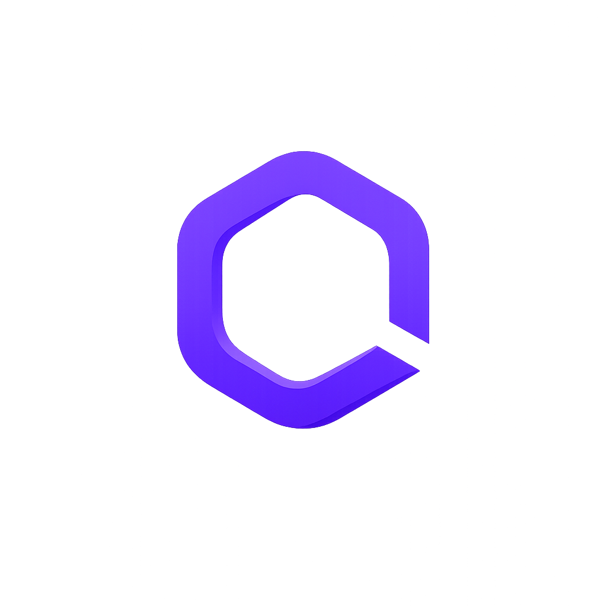

  

# Once

Once is a modern build system for the age of agents, designed for developers
and coding agents alike.

Bring caching and remote execution to your builds, wherever you start:

- **Your scripts:** make existing automation cacheable and remotely executable.
- **Your projects:** build existing projects, including Cargo workspaces, without
  migrating to a new build definition.
- **Your build graph:** use Once's own language to declare typed targets and
  compose your builds.

Developer experience comes first. Reliable, reproducible builds should fit your
project, not require you to adopt the assumptions of an enterprise-scale build
system.

[Get started with the documentation →](https://buildonce.dev/docs)
