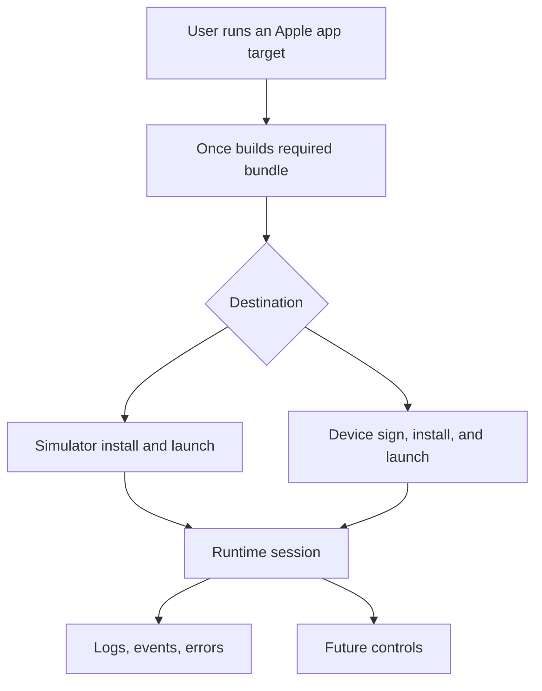

# Apple Run Capability

## Problem Frame

Apple application targets can already declare a `run` capability, but that
capability does not yet launch the built product. Once should make `once run`
useful for Apple app development by building the app, launching it on an
explicit destination, and exposing a standard runtime session that agents and
humans can inspect while the product is running.

The first useful slice should favor a real local Apple run over a purely
abstract runtime contract. The runtime contract still matters because logs,
errors, and future controls such as screenshots or interaction should not be
Apple-only special cases.

## Requirements

**Run Behavior**
- R1. `once run` on an Apple application target must build the required bundle before launching it.
- R2. A run must target an explicit destination, with simulator and physical device destinations supported in the first slice.
- R3. Simulator runs must install and launch the built application on the selected simulator.
- R4. Device runs must sign, install, and launch the built application on the selected physical device.
- R5. A successful run must report the launched bundle, bundle identifier, destination, process or launch identifier when available, runtime session location, and supported runtime interfaces in structured output.
- R6. Failed runs must surface structured diagnostics that distinguish build failure, destination selection failure, signing failure, install failure, launch failure, and runtime observation failure.
- R7. Build outputs may be reused from cache, but install, launch, and runtime session creation must execute on every `once run` invocation.
- R8. Destination selection must drive a compatible Apple build variant before launch, or fail before install with a structured diagnostic when the target configuration cannot produce a runnable bundle for that destination.
- R9. Users and agents must be able to enumerate or validate available destinations through a machine-readable interface before running.
- R10. The first implementation must declare its supported platform and destination matrix. At minimum, it must support an iOS simulator and a tethered iOS device, with structured unsupported-destination diagnostics for the rest.

**Device Signing**
- R11. Device signing must use explicit user-provided signing inputs rather than automatic discovery in the first slice.
- R12. Missing or inconsistent signing inputs must fail before install with actionable repairs rather than falling through to opaque Apple tooling errors.
- R13. The device signing path must support provisioning profile, signing identity or team selection, bundle identifier validation, and entitlements needed for a runnable development build.
- R14. Simulator runs must not require device signing inputs.
- R15. Device runs must perform a signing and device preflight that validates declared inputs, relevant machine state, and relevant device state, or reports which condition could not be validated.

**Runtime Session**
- R16. Every launched Apple run must create an inspectable runtime session with a stable descriptor shape.
- R17. The runtime session must expose log querying and log streaming for the minimum reliable log sources per destination, and must report unsupported or unavailable log sources structurally.
- R18. The runtime session must expose queryable error and event records for launch lifecycle events, including install, launch, process exit, and known failure states.
- R19. Apple runs must reuse the existing runtime session concepts and avoid Apple-only command families, so other runnable product types can later expose the same logs, events, errors, and controls.
- R20. A run attempt that reaches destination resolution must create a runtime session before install and launch so pre-launch failures still have lifecycle events and diagnostics attached to the session.
- R21. Runtime sessions must define IDs, retention, cleanup, concurrent-run behavior, reconnect behavior, and process-exit semantics.

**Agent Readiness**
- R22. Agents must be able to discover that an Apple application target is runnable through the existing target capability surface.
- R23. Agents must be able to run, inspect logs, query errors, and identify the active destination without scraping human-oriented output.
- R24. The first slice must leave a clear extension point for future interactive controls such as screenshots, UI interaction, or process control, but it does not need to implement those controls.

## Success Criteria

- `once run` can launch a minimal iOS application on a simulator and on a tethered physical device when explicit signing inputs are provided.
- Repeated `once run` invocations relaunch the application even when the build outputs are cache hits.
- Structured output identifies the destination, launch status, runtime session, and runtime interfaces.
- Runtime queries can fetch logs and lifecycle errors from a launched Apple run.
- Device signing failures are understandable from Once diagnostics without requiring users or agents to parse raw Apple command output first.
- The resulting runtime session model avoids Apple-only concepts in its common logs, events, errors, and interface descriptors.

## Scope Boundaries

- Do not implement screenshots, UI interaction, or remote control in the first slice.
- Do not add automatic signing identity or provisioning profile discovery in the first slice.
- Do not make web server or CLI runtime adapters part of the Apple run implementation, but keep the interface general enough for them.
- Do not support every Apple platform destination variant at equal depth. Unsupported destinations should fail with structured diagnostics instead of best-effort behavior.
- Do not bypass Once's existing execution and runtime substrates for build, run, logs, or events.

## Key Decisions

- Prioritize real Apple app launch first: This makes the existing `run` capability immediately useful instead of only designing an abstract contract.
- Support simulator and physical device destinations in the first slice: Apple product runs should cover the core local development paths, not only the easiest simulator path.
- Require explicit signing inputs for device runs: This avoids hidden account or keychain heuristics and gives agents deterministic failures they can repair.
- Keep launch side effects uncached: Caching the build is useful, but caching install or launch would make `once run` report success without actually starting the app.
- Keep interactive controls out of the first slice: Logs, events, and errors create the durable base that screenshots and interaction can attach to later.

## Dependencies / Assumptions

- Apple application build outputs already include an application bundle and ad-hoc signing for current local build compatibility.
- Non-ad-hoc signing and provisioning attributes are declared but not implemented today, so device run support depends on expanding that behavior.
- The existing runtime inspection surface already supports session description, logs, events, and log streaming for script-backed runtime sessions.
- Device runs depend on local Apple tooling, keychain access, a trusted and unlocked device, Developer Mode when required, and provisioning that includes the selected device.
- Planning must verify that the runtime session model supports non-child processes, external log streams, partial launch state, and destination-scoped metadata.

## Outstanding Questions

### Resolve Before Planning
- None.

### Deferred to Planning
- [Affects R2, R9][Technical] Define the destination selector shape for simulator and device targets.
- [Affects R4][Needs research] Confirm the best local Apple tooling path for physical device install and launch across current Xcode versions.
- [Affects R13][Technical] Decide the exact manifest attributes or CLI flags that represent explicit signing inputs.
- [Affects R17][Needs research] Determine the minimum reliable log sources per destination without overreaching.

## Next Steps

→ /ce:plan for structured implementation planning
