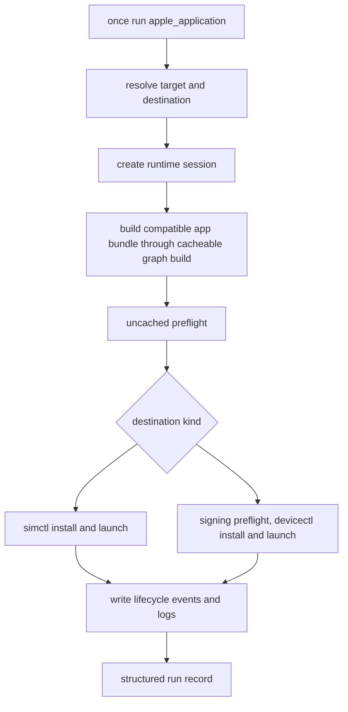

# feat: Add Apple run capability

## Overview

`once run` should launch Apple application targets instead of writing a placeholder run record. The plan separates cacheable build work from uncached local run side effects, adds machine-readable destination discovery, expands explicit device signing support, and reuses Once runtime sessions for Apple lifecycle events, logs, and diagnostics.

The first supported matrix is an iOS application on an iOS simulator and a tethered iOS device. Other destinations should fail early with structured unsupported-destination diagnostics until they are intentionally added.

## Problem Frame

Apple application rules already expose a `run` capability, but graph `run` currently executes a cacheable placeholder action. That violates the desired behavior for real app runs: a repeated `once run` must install and launch again even if the app build is a cache hit. Agents also need to discover destinations, pass explicit signing inputs, inspect lifecycle events, and query logs without scraping human output. See origin: `docs/brainstorms/2026-06-12-apple-run-capability-requirements.md`.

## Requirements Trace

- R1-R6. Apple app runs build, install, launch, report structured status, and classify failures by phase.
- R7. Build outputs may be cached, but install, launch, and session creation always run per invocation.
- R8-R10. Destination selection drives or validates the build variant, exposes machine-readable discovery, and starts with iOS simulator plus tethered iOS device.
- R11-R15. Device signing uses explicit inputs, validates signing and device state, and does not apply to simulator runs.
- R16-R21. Apple run attempts create inspectable runtime sessions with logs, events, errors, lifecycle semantics, and no Apple-only command family.
- R22-R24. Agents can discover runnable targets, run them, inspect logs and errors, identify destinations, and later attach richer controls.

## Scope Boundaries

- No screenshots, UI interaction, or remote control in this plan.
- No automatic Apple Developer account mutation, provisioning updates, or device registration in this plan.
- No web server or CLI-product runtime adapter in this plan. This plan does include minimal CLI and MCP inspection wrappers for runtime description, events, and logs, so agents can complete the Apple run/debug loop without hand-writing JSON-RPC requests or scraping human output.
- No best-effort support for watchOS, tvOS, visionOS, Mac Catalyst, or macOS app run destinations.
- No public SDK exposure for script execution, runtime sessions, frontend internals, or provider internals.

## Context & Research

### Relevant Code and Patterns

- `crates/once-cli/src/dispatch.rs` routes graph targets exposing `run` to graph execution before falling back to script execution.
- `crates/once-cli/src/commands/graph/mod.rs` builds graph targets first, then executes the selected capability.
- `crates/once-cli/src/commands/graph/action.rs` contains the current cacheable placeholder run action that writes `.once/out/<target>/run/run.json`.
- `crates/once-cli/src/commands/graph/analysis.rs` executes Starlark-declared build actions through Once's cacheable action substrate.
- `crates/once-cli/src/commands/run/session.rs` and `crates/once-cli/src/commands/runtime/session.rs` define runtime session files, logs, events, and JSON-RPC-backed queries for script-backed sessions.
- `crates/once-cli/src/commands/runtime/server.rs` exposes `runtime.describe`, `events.query`, `logs.query`, and `logs.stream`.
- `crates/once-cli/src/cli/query.rs`, `crates/once-cli/src/commands/query.rs`, and `crates/once-cli/src/commands/mcp.rs` are the existing machine-readable query/MCP pattern to mirror for destination discovery.
- `crates/once-frontend/prelude/apple.star` defines `apple_application`, current app build, ad-hoc codesigning, and declared but rejected provisioning and entitlements attrs.
- `crates/once-frontend/src/target_validator.rs` and `crates/once-frontend/src/manifest_editor.rs` are the validation and repair surfaces to keep agent retries structured.
- `spec/apple_spec.sh` covers Apple graph behavior and currently asserts placeholder run output.

### Institutional Learnings

- No `docs/solutions/` learnings exist for this area.
- `rfcs/0001-build-graph.md` applies directly: capabilities are the contract between CLI, agents, analysis, and execution; `run` depends on declared build outputs; diagnostics and repairs should be structured.
- `AGENTS.md` applies directly: new toolchain surfaces must stay discoverable, schema-queryable, example-backed, and mirrored between MCP and CLI.

### External References

- Apple simulator orchestration should use `xcrun simctl`, with JSON output where available.
- Tethered device orchestration should use `xcrun devicectl`, consuming file-based JSON output rather than human stdout.
- Physical device runs depend on pairing, trust, Developer Mode, usable platform services, signing identity/private key availability, provisioning profile validity, bundle identifier matching, and entitlement compatibility.
- Build-system prior art separates cacheable build artifacts from run/install side effects. Bazel `run` and Buck install flows do not treat device state as a replayable build artifact.
- Full device log archives can be large and privacy-sensitive. The first slice should capture scoped logs and lifecycle events, with unsupported log sources represented structurally.

## Key Technical Decisions

- **Split build from run orchestration:** Graph Apple `run` should call the existing cacheable build path, then execute a local uncached Apple run orchestrator for preflight, install, launch, session creation, and logs. This satisfies R7 while preserving cache value.
- **Keep Apple launch logic out of generic graph action construction:** Generic graph capability execution should continue to work for build/test placeholders, while Apple runtime launch behavior belongs to Apple runner rules. This avoids turning all graph capabilities into Apple-specific code.
- **Model runtime selection through rules:** Simulator and device concepts should live in Apple prelude runner rules, not in Once core CLI flags or MCP tools.
- **Require stable identifiers inside runner rules:** Apple runner rules may use simulator UDIDs and device/CoreDevice identifiers rather than names for reproducible runs. Human names can appear as display fields only.
- **Keep live destination state out of app manifests:** Application manifests describe buildable Apple bundles. Runtime selection belongs to runner targets or private local runner configuration.
- **Let runner rules drive Apple analysis configuration:** An Apple runner rule should produce the analysis configuration that sets the Apple SDK variant for the target and transitive Apple deps before Starlark build analysis. Implementers should not mutate manifests, duplicate targets, or rely on a simulator-built bundle for device launch.
- **Own explicit signing inputs in the Apple rule/run surface:** Device runs should not auto-discover or mutate developer accounts. The build/signing path should accept declared identity/profile/entitlement inputs and preflight them before install.
- **Split portable signing policy from local signing material:** Manifests may declare portable signing mode, entitlements file, bundle ID, and optional provisioning profile reference. Machine-local material such as certificate fingerprint, keychain scope, provisioning profile path, and physical destination ID should come from CLI args or private local config, not source-controlled manifests.
- **Keep device signing local-only:** Device signing is a local run side effect. The cacheable build may produce a device-compatible unsigned or ad-hoc intermediate bundle, but embedding provisioning profiles and invoking a developer identity must run outside the remote/action cache. Signed device bundles, embedded provisioning profiles, signing diagnostics, and signing tool outputs must not be uploaded to remote cache providers or stored in shared CAS records.
- **Sign a private staged copy for device runs:** Device signing must copy the build provider's app bundle into a per-session local staging directory and sign that copy. The launcher consumes the staged signed bundle, never mutates provider `app_path`, and cleans stale staged profiles/signatures with the session cleanup policy.
- **Create sessions before install and launch:** Once a target and destination resolve, a runtime session should exist even when signing, install, or launch fails. That keeps lifecycle events and diagnostics queryable.
- **Treat logs as source-specific:** Simulator and device logs have different tooling and reliability. The common runtime shape should expose available sources and structured unavailability, not pretend every destination can stream the same logs.

### Automation Contracts

Automation-facing runtime selection should happen through typed runner targets. The runner target carries any prelude-specific selector fields, and agents discover those fields through `once query schema` rather than through core destination commands. Display names are human-only and must never be required for automation.

Initial explicit signing inputs:

- Manifest attrs: `signing = "ad_hoc" | "development"`, `entitlements`, `provisioning_profile`, and `bundle_id`.
- Local-only run inputs or private config: signing identity fingerprint, optional keychain scope, and optional provisioning profile path when the manifest reference is not resolvable from the local profile store.
- Diagnostics and runtime events must redact local paths, unrelated keychain/profile metadata, certificate common names where possible, and raw provisioning profile contents.

Per-run runtime configuration, implemented by Apple runner rules:

- A simulator runner maps to Apple SDK variant `simulator`.
- A device runner maps to Apple SDK variant `device`.
- The runner passes this configuration into graph analysis before build. Starlark rules validate target/dependency compatibility and signing requirements for the requested variant. If a target or dependency cannot be configured for the requested variant, the run fails before build with a structured diagnostic.

### Apple Run Diagnostic Contract

All destination, validation, run, signing, install, launch, and observation failures use the same structured diagnostic shape across CLI JSON, CLI TOON, MCP, and runtime events.

Fields:

- `code`: stable snake_case code for automation.
- `severity`: `error`, `warning`, or `info`.
- `phase`: `destination_discovery`, `validation`, `build`, `signing`, `preflight`, `install`, `launch`, `observation`, or `logs`.
- `target`: target id when known.
- `destination`: `{ kind, id }` when known.
- `tool`: tool name when a local Apple tool produced the failure.
- `message`: human-readable explanation, not required for parsing.
- `repairs`: structured repair suggestions when available.
- `redacted_output_path`: path to captured redacted tool output when available.
- `session_id`: present for failures after session creation.

Initial stable codes include `missing_destination_selector`, `unsupported_destination`, `destination_unavailable`, `missing_xcode_tooling`, `remote_apple_run_unsupported`, `signing_identity_missing`, `provisioning_profile_missing`, `provisioning_profile_device_mismatch`, `bundle_identifier_profile_mismatch`, `entitlement_profile_mismatch`, `device_locked`, `device_untrusted`, `developer_mode_disabled`, `install_failed`, `launch_failed`, and `log_source_unavailable`.

### Apple Run Machine Record

`once run --format json|toon` returns a stable machine record on both success and failure. The record includes target, capability, destination, build status and cache result, run status and phase, session ID when created, bundle ID, process ID when known, diagnostics, event/log cursors, and available log sources. If a session was created, `session_id` must be present even when install or launch fails. If failure happens before session creation, `session_id` is null and diagnostics explain why.

MCP runtime and destination tools must validate opaque session IDs, reject path-like IDs, scope all session access to the current workspace's private session root, require explicit opt-in for physical-device enumeration and unbounded log streaming, preserve redaction, and avoid exposing arbitrary runtime files.

## Open Questions

### Resolved During Planning

- **Which destinations are in scope first?** iOS simulator and tethered iOS device. Other destinations return unsupported diagnostics.
- **Should install/launch use the action cache?** No. Build is cacheable; preflight, install, launch, and session/log observation are uncached per invocation.
- **Which tooling should the first implementation target?** `simctl` for simulator, `devicectl` for device. Use JSON/file output when available and capture redacted diagnostics by default.
- **Should automatic provisioning be included?** No. Explicit signing inputs only, with no Apple Developer account mutation.
- **What is the automation-facing destination selector?** A typed Apple runner target with schema-declared selector attrs.
- **What is the initial signing contract?** Portable manifest attrs are `signing`, `entitlements`, `provisioning_profile`, and `bundle_id`; machine-local identity/profile material comes from CLI args or private local config.
- **How does a destination drive the build variant?** The run orchestrator passes per-run Apple analysis configuration into graph analysis before build.

### Deferred to Implementation

- **Exact log source coverage per Xcode version:** Implement adapters with capability detection and structured unavailable records instead of assuming all log modes exist.
- **Exact process identifiers returned by tools:** Preserve launch/process IDs when tools provide them, and report absence structurally when they do not.

## High-Level Technical Design

> *This illustrates the intended approach and is directional guidance for review, not implementation specification. The implementing agent should treat it as context, not code to reproduce.*

## Implementation Units

- [ ] **Unit 1: Model static Apple run inputs and validation**

**Goal:** Add static Apple run compatibility and signing concepts to the Apple rule/query surface without storing live destination state or launching anything yet.

**Requirements:** R8-R15, R22

**Dependencies:** None

**Files:**
- Modify: `crates/once-frontend/prelude/apple.star`
- Modify: `crates/once-frontend/src/target_validator.rs`
- Modify: `crates/once-frontend/src/manifest_editor.rs`
- Modify: `docs/reference/prelude/apple_application.md`
- Modify: `docs/guide/graph/apple.md`
- Test: `crates/once-frontend/src/target_validator.rs`
- Test: `crates/once-frontend/tests/examples.rs`
- Test: `spec/apple_spec.sh`

**Approach:**
- Reuse existing static compatibility attrs where possible: `platform`, `sdk_variant`, `bundle_id`, `signing`, `entitlements`, and `provisioning_profile`.
- Add only the missing local signing selectors needed for device preflight/run, keeping source-controlled manifests free of private key material and raw profile contents.
- Do not store simulator UDIDs, CoreDevice identifiers, or live destination availability in manifests or frontend validators.
- Keep simulator runs independent from device signing attrs.
- Recognize device signing attrs at the schema/validation layer, but keep an explicit structured unsupported-signing diagnostic until Unit 6 implements provisioning, entitlements, and identity-backed signing.
- Keep the runnable starter example valid without requiring physical device signing inputs.

**Patterns to follow:**
- Existing `apple_application` schema and capability declarations in `crates/once-frontend/prelude/apple.star`.
- Existing `Diagnostic` and repair behavior in `crates/once-frontend/src/target_validator.rs`.

**Test scenarios:**
- Happy path: simulator-oriented `apple_application` validates without device signing attrs.
- Happy path: device-oriented `apple_application` with explicit signing inputs validates.
- Error path: raw provisioning profile contents, private keys, or live destination IDs in manifests produce structured diagnostics.
- Error path: device-oriented target missing signing identity returns a diagnostic with a repair targeting the missing attr.
- Error path: device-oriented target missing provisioning profile returns a diagnostic with a repair targeting the missing attr.
- Error path: simulator target with device-only signing attrs does not require them to run.
- Error path: device signing declaration is schema-valid but build/run reports `device_signing_not_implemented` until Unit 6 lands.
- Integration: bundled Apple examples still load without diagnostics.

**Verification:**
- Agents can query the `apple_application` schema and see the new attrs, defaults, capability metadata, and examples.
- Invalid device signing declarations fail before run with structured diagnostics.

- [x] **Unit 2: Add destination discovery surfaces**

**Goal:** Let users and agents discover or validate host-visible simulator and device destination selectors before invoking `once run`.

**Requirements:** R2, R9, R10, R22, R23

**Dependencies:** None

**Files:**
- Modify: `crates/once-cli/src/cli/query.rs`
- Modify: `crates/once-cli/src/commands/query.rs`
- Modify: `crates/once-cli/src/commands/mcp.rs`
- Modify: `crates/once-cli/src/reference.rs`
- Create: `crates/once-cli/src/commands/apple/mod.rs`
- Create: `crates/once-cli/src/commands/apple/destination.rs`
- Create: `crates/once-cli/src/commands/apple/simctl.rs`
- Create: `crates/once-cli/src/commands/apple/devicectl.rs`
- Modify: `docs/reference/cli/query.md`
- Modify: `docs/reference/mcp/tools.md`
- Test: `crates/once-cli/src/commands/query.rs`
- Test: `crates/once-cli/src/commands/mcp.rs`
- Test: `spec/apple_spec.sh`
- Test: `spec/cli_surface_spec.sh`

**Approach:**
- Add a query subcommand and matching MCP tool that return machine-readable destination records.
- Add a side-effect-free destination selector validation surface for CLI and MCP. The response should include `valid`, `target`, `destination`, `diagnostics`, and `repairs`.
- Validation must not inspect Apple rule attrs, choose build variants, validate signing requirements, boot simulators, install apps, launch apps, mutate signing state, or create runtime sessions. Build-system-specific compatibility remains in Starlark.
- Normalize records around stable ID, kind, platform, runtime or OS version, display name, availability, support status, and structured reasons when unsupported.
- Treat physical device destination records as privacy-sensitive. Do not return serial numbers, ECIDs, pairing records, phone numbers, Apple IDs, or raw `devicectl` payloads. Physical device enumeration should require an explicit opt-in selector or flag, while simulator discovery can remain the default.
- Keep tooling adapters testable by parsing fixtures rather than requiring physical devices in unit tests.
- Prefer `simctl` JSON for simulators and `devicectl` file JSON for devices.
- Graph launchers must consume the same adapter/domain records as destination discovery. No launcher should parse `simctl` or `devicectl` output directly.

**Patterns to follow:**
- Existing `query targets`, `query capabilities`, and MCP tool mirroring.
- Existing generated reference-doc flow in `crates/once-cli/src/reference.rs`.

**Test scenarios:**
- Happy path: destination query renders simulator records in JSON with stable IDs and availability.
- Happy path: destination discovery returns equivalent field sets under `--format json` and `--format toon`.
- Happy path: simulator destination validates for a simulator-compatible iOS app target.
- Happy path: destination query renders device records from a `devicectl` fixture with stable IDs and support status.
- Edge case: duplicate display names remain distinguishable by stable ID.
- Error path: missing Xcode tooling returns a structured unavailable diagnostic.
- Error path: unsupported platform selector returns a structured unsupported-destination diagnostic.
- Error path: missing or unavailable destination returns structured diagnostics and repairs without invoking install or launch tooling.
- Error path: unsupported destination diagnostics expose the same structured fields under JSON and TOON.
- Integration: MCP `tools/list` includes the destination query tool, and `tools/call` returns the same shape as the CLI.

**Verification:**
- Agents can enumerate valid destinations without scraping human output or running an app.

- [ ] **Unit 3: Extend runtime sessions for Apple run attempts**

**Goal:** Make runtime sessions usable for graph-backed Apple runs and pre-launch failures.

**Requirements:** R5, R6, R16-R21, R23, R24

**Dependencies:** None

**Files:**
- Modify: `crates/once-cli/src/commands/run/session.rs`
- Modify: `crates/once-cli/src/commands/run/runtime_descriptor.rs`
- Modify: `crates/once-cli/src/commands/runtime/session.rs`
- Modify: `crates/once-cli/src/commands/runtime/server.rs`
- Modify: `crates/once-cli/src/cli/runtime.rs`
- Modify: `crates/once-cli/src/dispatch.rs`
- Modify: `crates/once-cli/src/commands/mcp.rs`
- Create: `crates/once-cli/src/commands/runtime/session_writer.rs`
- Test: `crates/once-cli/src/commands/runtime/session.rs`
- Test: `crates/once-cli/src/commands/runtime/server.rs`
- Test: `crates/once-cli/src/commands/runtime/session_writer.rs`
- Test: `crates/once-cli/src/commands/mcp.rs`
- Test: `spec/apple_spec.sh`

**Approach:**
- Move shared session preparation into a runtime-owned writer module. Script runs and graph Apple runs both use the same writer, and graph code must not depend on script-run session internals.
- Add session metadata for target, capability, destination, bundle ID, launch status, supported log sources, and terminal state.
- Write lifecycle events before and after preflight, install, launch, observation startup, process exit, and failure.
- Keep `runtime.describe`, `events.query`, `logs.query`, and `logs.stream` as the common JSON-RPC interface.
- Add structured CLI wrappers and matching MCP tools for runtime describe, events, and logs. Each wrapper should support JSON and TOON, bounded defaults, cursors, limits, and relevant filters.
- Extend `logs.stream` to stream both file-backed logs and `events.ndjson` log records using cursors. Streaming must not assume stdout/stderr child ownership.
- Runtime event and log query responses are bounded by default and include `limit`, `truncated`, and `next_cursor`.
- Apple runtime session directories must use private local permissions. Avoid predictable sockets in shared temporary directories, and reject symlinked session paths or log files before writing sensitive runtime data.
- Runtime sessions should store structured, redacted Apple tool diagnostics by default. Raw Apple tool stdout/stderr and device log archives require an explicit debug flag.
- Bundle/process-predicated log capture is required by default. If scoped capture is unavailable, return `log_source_unavailable` unless an explicit debug flag enables broader capture. Raw or broad logs must have stricter retention and must not be exposed through MCP by default.
- Define default TTL and size caps for sessions. Debug/raw tool output should have shorter retention than redacted structured events and logs, and CLI/MCP should expose deletion semantics for sessions.
- Define retention, session ID generation, cleanup hooks, reconnect semantics, and concurrent session behavior in the session metadata and tests.

**Patterns to follow:**
- Existing `session.json`, `stdout.log`, `stderr.log`, and `events.ndjson` layout.
- Existing runtime server methods and query filters.

**Test scenarios:**
- Happy path: creating an Apple run session writes `session.json` with runtime descriptor, target, capability, and destination metadata.
- Happy path: lifecycle events can be queried by domain, kind, and cursor.
- Happy path: after `once run --format json`, an agent can use only the returned session ID with CLI runtime commands or MCP tools to fetch description, events, and logs.
- Error path: a pre-launch signing failure is visible through `events.query` and does not require reading stderr.
- Error path: failed install or launch is inspectable through runtime CLI/MCP without reading stderr.
- Edge case: two runs of the same target to different destinations create distinct sessions.
- Edge case: repeated runs to the same destination mark sessions distinctly and do not reuse stale socket paths.
- Edge case: logs query with more than the default limit returns `truncated: true` and `next_cursor`, and cursor follow-up returns the next page without duplicates.
- Error path: scoped log capture unavailable returns `log_source_unavailable` instead of collecting broad system/device logs by default.
- Safety path: logs and events never expose unredacted Apple tool output by default.
- Safety path: MCP rejects path-like session IDs and cannot read runtime files outside the current workspace session root.
- Safety path: session cleanup removes expired debug/raw outputs before redacted structured records.
- Safety path: session directory, logs, events, session.json, and control socket parent have private permissions on macOS.
- Safety path: pre-existing symlinked session/log paths are rejected before writing Apple tool output.
- Integration: `logs.query` returns structured unavailable records for log sources that the launcher could not attach.
- Integration: runtime describe, events, and logs expose equivalent field sets under `--format json` and `--format toon`.

**Verification:**
- Apple run attempts have inspectable runtime sessions even when install or launch fails.

- [ ] **Unit 4: Split graph Apple run orchestration from cached actions**

**Goal:** Make `once run` for `apple_application` invoke cacheable build first, then always perform uncached local preflight/install/launch/session work.

**Requirements:** R1-R8, R18-R21, R23

**Dependencies:** Units 1 and 3

**Files:**
- Modify: `crates/once-cli/src/dispatch.rs`
- Modify: `crates/once-cli/src/cli.rs`
- Modify: `crates/once-cli/src/commands/graph/mod.rs`
- Modify: `crates/once-cli/src/commands/graph/action.rs`
- Modify: `crates/once-cli/src/commands/graph/analysis.rs`
- Modify: `crates/once-frontend/src/analysis.rs`
- Modify: `crates/once-frontend/src/graph.rs`
- Create: `crates/once-cli/src/commands/graph/apple_run.rs`
- Test: `crates/once-cli/src/commands/graph/mod.rs`
- Test: `crates/once-cli/src/commands/graph/action.rs`
- Test: `crates/once-cli/src/commands/graph/apple_run.rs`
- Test: `spec/apple_spec.sh`
- Test: `spec/run_spec.sh`

**Approach:**
- Add an Apple runner rule that depends on an `apple_application` bundle provider and exposes `run`.
- Keep runtime selector attrs on the runner rule, so agents discover the contract with `once query schema` and Once core does not grow Apple-specific run flags.
- Route the runner rule through typed Starlark-owned launch behavior instead of generic graph action construction.
- Preserve the existing graph build path and record whether the build was a cache hit or miss separately from launch status.
- Reuse or expose the existing graph build outcome so the Apple run orchestrator receives provider data, declared outputs, action digest, and cache hit or miss. The orchestrator must consume the `apple_application` provider for `app_path` and `bundle_id`; it must not infer bundle paths from target names or output conventions.
- Map runner attrs to the configured build variant before analysis. If the target's static attrs force an incompatible `sdk_variant` or platform, fail before build or install with a structured diagnostic.
- Add a runner-provided Apple analysis configuration API rather than mutating target attrs or manifests. The configuration must apply consistently to transitive Apple deps before Starlark analysis so device runs do not reuse simulator-built dependencies.
- Wrap destination resolution, build, preflight, install, and launch in one structured failure boundary so build failures also produce the Apple run machine record.
- Keep `--remote` unsupported for Apple run side effects, with a structured `remote_apple_run_unsupported` diagnostic in JSON, TOON, and MCP-visible output.
- Replace the placeholder run action only for real Apple application runs. Leave generic fallback behavior available where still needed.

**Patterns to follow:**
- Existing graph `build_target` sequencing in `crates/once-cli/src/commands/graph/mod.rs`.
- Existing output rendering patterns for human, JSON, and TOON formats.

**Test scenarios:**
- Happy path: Apple run invokes build and then an uncached launcher path.
- Happy path: repeated Apple run with a cached build still invokes install and launch orchestration again.
- Happy path: device destination passes `sdk_variant = device` through analysis for the app and transitive Apple deps.
- Error path: `--remote` with Apple run fails before launch side effects.
- Error path: invalid or missing runner selector attrs fail with actionable structured output.
- Error path: Apple run fails structurally when the build provider lacks `app_path` or `bundle_id`.
- Error path: compile or build failure returns the Apple run machine record with phase `build`, diagnostics, and session behavior matching the contract.
- Error path: non-zero `once run --format json` still writes the structured run record with diagnostics to stdout, so agents do not need stderr to choose the next command.
- Edge case: script targets still support their existing `--runtime-rpc` behavior.
- Integration: graph build/test behavior outside Apple run remains unchanged.

**Verification:**
- Cache hits never suppress install, launch, or runtime session creation.

- [ ] **Unit 5: Implement simulator launcher**

**Goal:** Launch built iOS application bundles on an explicit iOS simulator destination with session events and logs.

**Requirements:** R1-R10, R14, R16-R24

**Dependencies:** Units 2, 3, and 4

**Files:**
- Create: `crates/once-cli/src/commands/graph/apple_run/simulator.rs`
- Modify: `crates/once-cli/src/commands/graph/apple_run.rs`
- Modify: `crates/once-cli/src/commands/apple/destination.rs`
- Modify: `crates/once-cli/src/commands/apple/simctl.rs`
- Test: `crates/once-cli/src/commands/graph/apple_run/simulator.rs`
- Test: `spec/apple_spec.sh`

**Approach:**
- Validate that the selected destination is an iOS simulator and that the built bundle is simulator-compatible.
- Define the boot policy for shutdown simulators, including timeout and diagnostic behavior.
- Install the app, terminate any prior app process according to the repeated-run policy, launch the app, and capture launch identifiers when available.
- Capture reliable simulator log sources first, with structured unavailable records for log streams that cannot be attached.
- Write lifecycle events and redacted tool output paths to the runtime session.

**Patterns to follow:**
- Tool adapter and fixture parsing pattern from Unit 2.
- Runtime session event writing from Unit 3.

**Test scenarios:**
- Happy path: selected booted simulator installs and launches the app, then writes launched status and session metadata.
- Happy path: shutdown simulator follows the chosen boot policy and records boot lifecycle events.
- Error path: simulator destination with incompatible platform or runtime fails before install.
- Error path: install failure records phase, tool, destination, redacted output path or diagnostic summary, and repair hints.
- Error path: launch failure records phase, tool, destination, redacted output path or diagnostic summary, and repair hints.
- Edge case: repeated run terminates or replaces the prior app instance according to policy and creates a new session.

**Verification:**
- `once run` can launch the minimal iOS app fixture on a simulator when the host has the required simulator tooling.

- [ ] **Unit 6: Implement device signing and launcher**

**Goal:** Sign, preflight, install, and launch built iOS application bundles on an explicit tethered device destination.

**Requirements:** R1-R8, R10-R24

**Dependencies:** Units 1, 2, 3, and 4

**Files:**
- Modify: `crates/once-frontend/prelude/apple.star`
- Create: `crates/once-cli/src/commands/graph/apple_run/device.rs`
- Create: `crates/once-cli/src/commands/graph/apple_run/signing.rs`
- Modify: `crates/once-cli/src/commands/graph/apple_run.rs`
- Modify: `docs/reference/prelude/apple_application.md`
- Test: `crates/once-cli/src/commands/graph/apple_run/device.rs`
- Test: `crates/once-cli/src/commands/graph/apple_run/signing.rs`
- Test: `spec/apple_spec.sh`

**Approach:**
- Expand the Apple application build/run path so cacheable device-compatible intermediates can be locally signed for run without storing signed bundles in shared caches.
- Copy the provider `app_path` bundle into a private per-session staging directory before device signing. Signing, embedded provisioning profiles, and signing logs apply only to that staged copy.
- The device launcher consumes the staged signed bundle and never mutates the provider bundle path or declared build outputs.
- Keep signing inputs explicit and local. Do not enable automatic provisioning, device registration, certificate import, keychain unlock, keychain ACL changes, or Apple Developer account flows.
- Require an explicit signing identity selector for device runs, preferably a certificate fingerprint with optional keychain scope. Do not auto-select identities from team ID alone in the first slice.
- Fail closed when identity lookup has zero or multiple matches, when private-key access would require an interactive prompt, or when keychain access is unavailable. Diagnostics must not dump unrelated keychain identities.
- Preflight the selected device, Xcode tooling, keychain identity, provisioning profile, bundle identifier, device inclusion, expiration, and entitlement compatibility as far as the local machine can validate.
- Signing must fail closed on entitlement differences. Once may add only deterministic signing-required entitlements that are documented and tested. It must not implicitly add keychain access groups, app groups, associated domains, iCloud containers, push, HealthKit, or other capability entitlements unless they are declared by the target and allowed by the provisioning profile.
- Use `devicectl` for device install and launch, consuming stable JSON file output and writing redacted diagnostics to the session.
- Emit structured diagnostics for trust, Developer Mode, lock state, profile mismatch, entitlement mismatch, install failure, launch failure, and observation failure.

**Patterns to follow:**
- Existing ad-hoc codesigning action structure in `crates/once-frontend/prelude/apple.star`.
- Existing diagnostic and repair shape in frontend validation.
- Apple tooling adapter shape introduced by Unit 2.

**Test scenarios:**
- Happy path: valid signing inputs produce a device-signed app bundle record and pass signing preflight fixtures.
- Happy path: device signing creates a private staged bundle and leaves provider `app_path` unchanged.
- Happy path: device launcher parses `devicectl` install and launch fixture output into structured session events.
- Error path: missing signing identity produces a preflight diagnostic before install.
- Error path: ambiguous signing identity fails before signing and does not include unrelated keychain identities in diagnostics.
- Error path: keychain/private-key access unavailable fails with a non-interactive diagnostic before install.
- Error path: provisioning profile does not include selected device and reports a repairable diagnostic.
- Error path: bundle identifier does not match profile application identifier and reports a diagnostic before install.
- Error path: entitlement requested by app is not allowed by profile and reports a diagnostic before install.
- Error path: profile permits an entitlement that the target did not declare, and Once does not add it implicitly.
- Error path: device is unavailable, locked, untrusted, or missing Developer Mode and reports destination/device diagnostics.
- Safety path: device signing with a remote cache provider configured does not upload signed bundles, embedded provisioning profiles, or signing logs to the provider.
- Safety path: action/cache metadata stores profile digests or redacted identifiers only, never raw provisioning profile contents.
- Integration: simulator app runs still do not require device signing inputs.

**Verification:**
- `once run` can install and launch a minimal iOS app on a tethered device when explicit signing inputs and local device state are valid.

- [ ] **Unit 7: Finish CLI, docs, and end-to-end coverage**

**Goal:** Make the feature discoverable, documented, and covered across human CLI, JSON/TOON output, MCP, and shellspec.

**Requirements:** R5, R6, R9, R16-R24

**Dependencies:** Units 1-6

**Files:**
- Modify: `crates/once-cli/src/reference.rs`
- Modify: `docs/reference/cli/run.md`
- Modify: `docs/reference/cli/runtime.md`
- Modify: `docs/reference/cli/query.md`
- Modify: `docs/reference/mcp/tools.md`
- Modify: `docs/guide/graph/index.md`
- Modify: `docs/guide/graph/apple.md`
- Modify: `spec/apple_spec.sh`
- Modify: `spec/cli_surface_spec.sh`
- Test: `crates/once-cli/src/reference.rs`
- Test: `spec/apple_spec.sh`
- Test: `spec/cli_surface_spec.sh`

**Approach:**
- Update run help and generated references so `once run` no longer claims graph targets always run through the action cache.
- Document destination discovery, explicit destination selection, device signing preflight, session inspection, and unsupported destination diagnostics.
- Keep docs user-facing and avoid source path references in public guide/reference prose.
- Update shellspec expectations that currently assert placeholder `run.json` behavior.
- Include skipped or fixture-backed tests for environments without Apple tooling or physical devices.

**Patterns to follow:**
- Existing generated CLI reference tests in `crates/once-cli/src/reference.rs`.
- Existing Darwin/Xcode skip helpers in `spec/apple_spec.sh`.

**Test scenarios:**
- Happy path: CLI reference includes destination/run/runtime text and no stale cache-only run claim.
- Happy path: JSON and TOON output include destination, build cache status, launch status, and runtime session fields.
- Error path: unsupported destination emits structured diagnostics in JSON output.
- Integration: JSON/TOON parity tests cover destination discovery, destination validation, `once run` success, `once run` failure, runtime describe, runtime events, and runtime logs.
- Integration: MCP tool responses use the same JSON record shapes as the corresponding CLI `--format json` commands.
- Integration: shellspec covers simulator happy path when tooling is available and fixture-backed device diagnostics without requiring a real device.
- Integration: MCP docs include any new destination query tool with example output.

**Verification:**
- Documentation, generated references, shellspec, and unit tests describe the same run behavior.

## System-Wide Impact

- **Interaction graph:** `once run` dispatch, graph build, Apple launcher adapters, runtime session writer, runtime RPC, query/MCP destination discovery, and Apple rule validation all become part of one user flow.
- **Error propagation:** Tooling failures should be mapped into structured phase diagnostics with redacted output paths attached to the session. Raw `anyhow` strings should be reserved for unexpected internal failures.
- **State lifecycle risks:** Runs create local session state and mutate simulator/device state. Build outputs are cacheable, while destination locks, install, launch, process observation, and logs are local side effects.
- **API surface parity:** CLI destination discovery must have a matching MCP tool. JSON, TOON, and human output must carry equivalent information at different presentation levels.
- **Integration coverage:** Unit tests should cover parsers and diagnostics; shellspec should cover the CLI contract; fixture-backed tests should cover physical-device behavior without requiring a real device in CI.
- **Unchanged invariants:** The public Rust and Swift SDKs remain cache-focused and do not expose runtime sessions or frontend internals. Existing script run and runtime RPC behavior should remain compatible.

## Risks & Dependencies

| Risk | Mitigation |
|------|------------|
| Device tooling differs across Xcode versions | Gate adapters by detected capability, parse stable JSON/file outputs, and emit unsupported-tool diagnostics. |
| Launch side effects are accidentally cached | Keep Apple run orchestration outside `run_target_capability` and test repeated run behavior with cached builds. |
| Device signing becomes opaque | Validate explicit inputs and local state before install, then map failures to structured diagnostics with repairs. |
| Runtime session model assumes child processes | Extend sessions around lifecycle events and external process metadata rather than child-process ownership. |
| Log capture is unreliable or privacy-sensitive | Define minimum reliable sources per destination, scope logs by bundle/process where possible, and represent unavailable sources structurally. |
| Signed bundles or provisioning data leak through caches | Keep device signing local-only, avoid shared CAS records for signed bundles and profiles, and test remote-provider safety paths. |
| Keychain identity selection leaks private metadata | Require explicit identity selectors, fail closed on ambiguity, and redact keychain/certificate details in diagnostics. |
| Runtime session files expose device or signing metadata | Use private local permissions, avoid predictable shared socket paths, reject symlinked session/log files, and redact default logs. |
| Destination names are ambiguous | Require stable destination IDs for execution and use display names only for humans. |
| Destination discovery exposes personal device metadata | Redact physical device records, omit raw `devicectl` payloads, and require opt-in physical-device enumeration. |
| Physical-device tests are hard to run in CI | Use fixture-backed parser/preflight tests and skip real-device shellspecs unless the environment advertises a suitable device. |

## Documentation / Operational Notes

- Public docs should describe behavior and command contracts, not source file locations.
- Reference docs for `apple_application` must call out explicit signing inputs and simulator-vs-device behavior.
- CLI docs must explain that builds can be cache hits while launches always execute locally.
- Runtime docs must show how to inspect session description, events, and logs for Apple runs.
- Release notes should flag physical-device support as local-only and dependent on Xcode/device/signing state.

## Sources & References

- Origin document: [docs/brainstorms/2026-06-12-apple-run-capability-requirements.md](../brainstorms/2026-06-12-apple-run-capability-requirements.md)
- Build graph RFC: RFC 0001, Build graph
- Apple app rule reference: [docs/reference/prelude/apple_application.md](../reference/prelude/apple_application.md)
- Apple graph guide: [docs/guide/graph/apple.md](../guide/graph/apple.md)
- Apple, running apps on simulator or device: https://developer.apple.com/documentation/xcode/running-your-app-in-simulator-or-on-a-device
- Apple, Developer Mode: https://developer.apple.com/documentation/xcode/enabling-developer-mode-on-a-device
- Apple, development provisioning profiles: https://developer.apple.com/help/account/provisioning-profiles/create-a-development-provisioning-profile
- `xcodebuild` man page mirror: https://keith.github.io/xcode-man-pages/xcodebuild.1.html
- `xcrun` man page mirror: https://keith.github.io/xcode-man-pages/xcrun.1.html
- `log` man page mirror: https://keith.github.io/xcode-man-pages/log.1.html
- Buck2 install command: https://buck2.build/docs/users/commands/install/
- Bazel remote caching: https://bazel.build/remote/caching
